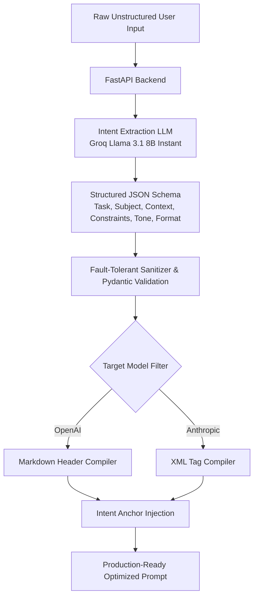

<div align="center">

# ⚡ Chatty — Universal Prompt Optimizer

### *Transform messy, unstructured inputs into precision-crafted, model-tailored LLM prompts.*

[](https://opensource.org/licenses/MIT)
[](https://www.python.org/)
[](https://fastapi.tiangolo.com/)
[](https://groq.com/)
[]()

[Key Features](#-key-features) • [How It Works](#-how-it-works) • [Quick Start](#-quick-start) • [API Reference](#-api-reference) • [Deployment](#-deployment) • [Contributing](#-contributing)

---

</div>

## 📌 Overview

Most LLM prompt improvers simply ask a large language model to "rewrite this prompt." This naive approach is **slow**, **costly**, and **non-deterministic** — frequently suffering from **intent drift** where the core task gets altered or lost.

**Chatty** solves this by implementing a **Hybrid Architecture**:
1. **Lightweight LLM Parsing**: Uses high-speed LLM inference (`llama-3.1-8b-instant` via Groq) strictly for structural **Intent Extraction** into a strict JSON schema.
2. **Deterministic Rule Engine Compilation**: Compiles the extracted JSON into model-optimized prompt structures applying model-specific heuristics (e.g., XML tags for Anthropic Claude, Markdown headers for OpenAI GPT).
3. **Intent Anchoring**: Preserves original raw context directly in the final output to guarantee zero intent loss.

---

## 🧠 How It Works



### Architecture Breakdown

| Step | Engine | Description |
| :--- | :--- | :--- |
| **1. Intent Extraction** | LLM (`llama-3.1-8b-instant`) | Parses unstructured text into `task_verb`, `subject`, `context`, `constraints`, `output_format`, and `tone_persona`. |
| **2. Fault Tolerance** | Python / Pydantic | Automatically fixes common LLM JSON hallucinations (e.g. string vs array constraints) with robust fallback handling. |
| **3. Compilation** | Deterministic Rule Engine | Generates model-specific markup (XML tags for Anthropic, Markdown headers for OpenAI). |
| **4. Intent Anchoring** | Post-Processor | Appends original task anchor to eliminate context drift. |

---

## ✨ Key Features

- ⚡ **Ultra-Fast & Cost-Efficient**: Powered by Groq's ultra-low latency inference engine (free tier available with zero base costs).
- 🎯 **Target Model Heuristics**: Dynamically formats output prompts tailored for **OpenAI (GPT-4o/3.5)** or **Anthropic (Claude 3.5 Sonnet)** syntax guidelines.
- 🛡️ **Fault-Tolerant Pipeline**: Built-in array wrapping and schema sanitization handles LLM output anomalies gracefully.
- 🖥️ **Modern Web Interface**: Minimalist, responsive UI embedded directly inside FastAPI.
- 🔌 **REST API Ready**: Production-ready FastAPI endpoints with automated Swagger UI docs (`/docs`).
- 🚀 **Zero-Config Deployment**: Ready to deploy in minutes on Render, Railway, Fly.io, or Docker.

---

## 🛠️ Quick Start

### Prerequisites

- **Python 3.8+** installed.
- A **Groq API Key** (Free tier available at [console.groq.com](https://console.groq.com/)).

### Installation

1. **Clone the repository**:
   ```bash
   git clone https://github.com/georgevpopa/chatty-prompt-optimizer.git
   cd chatty-prompt-optimizer
   ```

2. **Create & activate a virtual environment**:
   - **Windows (PowerShell)**:
     ```powershell
     python -m venv venv
     .\venv\Scripts\Activate.ps1
     ```
   - **macOS / Linux**:
     ```bash
     python -m venv venv
     source venv/bin/activate
     ```

3. **Install dependencies**:
   ```bash
   pip install -r requirements.txt
   ```

4. **Configure environment variable**:
   - **Windows (PowerShell)**:
     ```powershell
     $env:GROQ_API_KEY="gsk_your_groq_api_key_here"
     ```
   - **macOS / Linux**:
     ```bash
     export GROQ_API_KEY="gsk_your_groq_api_key_here"
     ```

5. **Launch the server**:
   ```bash
   uvicorn main:app --reload
   ```

6. **Open in browser**:
   - **Web UI**: [http://127.0.0.1:8000](http://127.0.0.1:8000)
   - **Interactive API Docs (Swagger)**: [http://127.0.0.1:8000/docs](http://127.0.0.1:8000/docs)

---

## 💻 Usage & Code Examples

### 1. Via Web UI

1. Type your raw prompt into the input panel (e.g., *"Write a python script for fast sorting, sound like an expert, output only code"*).
2. Select your target architecture: **OpenAI** or **Anthropic**.
3. Click **⚡ Generate Perfect Prompt** and copy your production-ready prompt!

### 2. Programmatic API Integration

#### PowerShell
```powershell
Invoke-RestMethod -Uri "http://127.0.0.1:8000/optimize" `
  -Method Post `
  -ContentType "application/json" `
  -Body '{"raw_input": "write a python script for sorting, must be fast", "target_model": "openai"}'
```

#### cURL
```bash
curl -X POST "http://127.0.0.1:8000/optimize" \
     -H "Content-Type: application/json" \
     -d '{
       "raw_input": "write a python script for sorting, must be fast",
       "target_model": "anthropic"
     }'
```

#### Python (`requests`)
```python
import requests

response = requests.post(
    "http://127.0.0.1:8000/optimize",
    json={
        "raw_input": "Write a blog post about python dicts, tone pirate",
        "target_model": "anthropic"
    }
)
print(response.json()["optimized_prompt"])
```

#### Sample Response Payload
```json
{
  "optimized_prompt": "**Role:** pirate\n\n**Instruction:** write the following: a blog post about python dicts\n\n<context>\nNot specified\n</context>\n\n**Output Format:** prose\n\n**Original User Request (Anchor):** a blog post about python dicts"
}
```

---

## 🔌 API Reference

| Endpoint | Method | Description | Content-Type |
| :--- | :--- | :--- | :--- |
| `/` | `GET` | Serves the web UI (`index.html`) | `text/html` |
| `/optimize` | `POST` | Optimizes a raw prompt input | `application/json` |
| `/docs` | `GET` | Interactive Swagger API documentation | `text/html` |

### Request Schema (`/optimize`)

```json
{
  "raw_input": "string (Required)",
  "target_model": "string (Optional: 'openai' | 'anthropic', Default: 'openai')"
}
```

---

## ☁️ Deployment Guide

Chatty is stateless and lightweight, making it ideal for cloud hosting platforms.

### Deploying to Render / Railway / Fly.io

1. Push your repository to GitHub.
2. Connect your repo on your platform of choice.
3. Configure the **Build & Start Commands**:
   - **Build Command**: `pip install -r requirements.txt`
   - **Start Command**: `uvicorn main:app --host 0.0.0.0 --port $PORT`
4. Set your Environment Variable:
   - `GROQ_API_KEY`: `your_groq_api_key`

---

## 📁 Project Structure

```text
chatty-prompt-optimizer/
├── main.py           # FastAPI server & route handlers
├── optimizer.py      # Core Hybrid Engine (Groq LLM extraction + Rule compilation)
├── index.html        # Embedded responsive dark-mode Web UI
├── requirements.txt  # Project dependencies
├── .gitignore        # Version control ignore rules
└── README.md         # Documentation
```

---

## 🤝 Contributing

Contributions, issues, and feature requests are welcome! Feel free to check the [issues page](https://github.com/georgevpopa/chatty-prompt-optimizer/issues).

1. Fork the Project
2. Create your Feature Branch (`git checkout -b feature/AmazingFeature`)
3. Commit your Changes (`git commit -m 'Add some AmazingFeature'`)
4. Push to the Branch (`git push origin feature/AmazingFeature`)
5. Open a Pull Request

---

## 📜 License

Distributed under the **MIT License**.

<div align="center">

Made with ❤️ by [George Popa](https://github.com/georgevpopa)

</div>